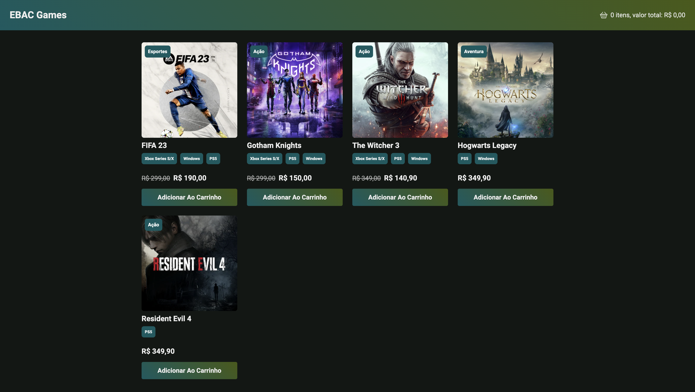

# Site EBAC Games

Este site de games foi construído com **Redux**, estilizado com **Styled Components**, que permite a inserção
de games no carrinho de compras, e o acumulo do valor total dos jogos inseridos no carrinho de compras.

Projeto desenvolvido no curso de Full Stack Python da EBAC - Escola Britânica de Artes Criativas e Tecnologia.

## 🚀 Começando

Estas instruções permitirão que você obtenha uma cópia do projeto em execução em sua máquina local para fins de desenvolvimento e teste.

### Pré-requisitos

Antes de começar, certifique-se de ter as seguintes ferramentas instaladas em sua máquina:

- **Node.js**
- **NPM (geralmente vem com o Node.js)**

Este projeto foi inicializado com [Create React App](https://github.com/facebook/create-react-app).

### Instalação

Siga estas etapas a seguir para configurar o ambiente de desenvolvimento:

1. Clone este repositório em sua máquina local.
2. Navegue até o diretório clonado.
3. Execute o seguinte comando para instalar as dependências:

  **``npm install``**

### Executar o projeto

**Json Database** age como um servidor fake de banco de dados.
Podemos instalar com o comando abaixo, passando o arquivo e a porta onde vai rodar o servidor.

  **``npx json-server db.json --port 4000``**

Para executar o projeto em modo de desenvolvimento, execute o comando:

  **``npm start``**

Abra [http://localhost:3000](http://localhost:3000) para visualizar no browser.

A página irá recarregar se alterações forem feitas.
Você também verá Lint erros no console, se existirem.

Para executar o projeto em produção, execute o comando:

  **``npm run build``**

Constrói o app para produção na pasta 'build'.
Corrige pacotes React em modo de produção e otimiza a contrução para uma melhor performance.

## 🛠️ Ferramentas utilizadas para construção do projeto

* **ESLint** - Linter, uma ferramenta de análise estática, para as linguagens Javascript e Typescript, sendo o mais popular do mundo para tais linguagens.
* **HTML** - Linguagem de marcação utilizada na construção de páginas na Web.
* **CSS** - Cascading Style Sheets é um mecanismo para adicionar estilos a uma página web.
* **ReactJS** - Biblioteca front-end JavaScript de código aberto com foco em criar interfaces de usuário em páginas web.
* **Redux** - É uma biblioteca JavaScript de código aberto para gerenciar o estado do aplicativo.
* **TypeScript** - Linguagem OpenSource desenvolvida pela Microsoft. É um superconjunto sintático estrito de JavaScript e adiciona tipagem estática opcional à linguagem.
* **Styled Components** - Uma biblioteca que nos permite escrever CSS em JavaScript enquanto construímos componentes customizados em ReactJS.
* **Jest** - Framework de teste em JavaScript projetado para garantir a correção de qualquer código JavaScript.
* **EditorConfig e Prettier** - Padrões de formatação de código no ambiente de desenvolvimento.
* **NPM** - Gerenciador de pacotes padrão para o ambiente de tempo de execução JavaScript Node.JS.

## 🎓 Aprenda mais

Você pode aprender mais em [Create React App documentation](https://facebook.github.io/create-react-app/docs/getting-started).

## ✒️ Autor

Guilherme Ferreira Camargo
